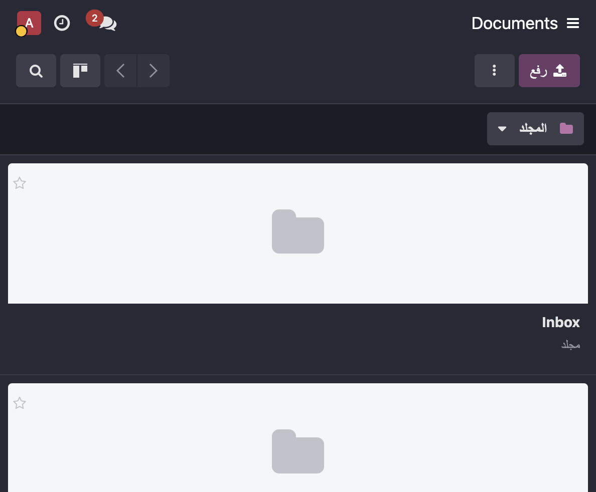

Flous Flow Documents
====================

Standalone **document management** for **Odoo 19 Community** — functionally
equivalent to the Enterprise *Documents* app, built as an original
implementation (no proprietary code copied). Folders, files, URLs, tags,
granular permissions, sharing, favorites, lock/unlock, email aliases and a
portal page — all in a native kanban view.

Features
--------

* **Folders are documents** — a folder is a ``flousflow.document`` record with
  ``type='folder'``, arranged in a tree via ``parent_path``.
* **Files & URLs** — upload binary attachments (version history kept) or save
  external links.
* **Native kanban view** — preview thumbnails for images, owner avatar,
  colored tags, favorite star, lock icon and a **Folders** search panel
  (exactly like the original app).
* **Granular permission model** — computed ``user_permission``
  (Editor / Viewer / None) with:
  * folder hierarchy inheritance (``access_internal``, ``none`` = inherit),
  * document owner override,
  * per-partner sharing with roles and expiration,
  * manager group override,
  * record rules enforcing least-privilege access.
* **Sharing wizard** — set internal/link rights and invite partners with a
  role and expiration date.
* **Favorites** — per-user starred documents with a dedicated filter.
* **Trash** — soft delete with configurable auto-purge delay and a dedicated
  Trash section (restore / confirmed permanent delete).
* **Lock / Unlock** — checkout documents so only the locker or a manager can
  edit.
* **Email alias on folders** — upload documents to a folder simply by sending
  an email to its alias address.
* **Request a file** — ask a partner to upload a document and track it with an
  activity.
* **Move / Copy** — bulk move or duplicate (deep copy for folders) into
  another folder.
* **Link to any record** — link documents to any Odoo record
  (``res_model`` / ``res_id``).
* **Portal** — ``/my/documents`` page with token-protected downloads.
* **Chatter & activities** — full ``mail.thread`` integration and an optional
  auto-created activity on upload.
* **Multi-company** safe (``_check_company_auto``).
* **Full Arabic (ar_001) translation** shipped in the module.

Installation
------------

Install like any Odoo module. The module depends only on standard Odoo apps:
``base``, ``mail``, ``web``, ``contacts`` and ``portal``.

Configuration
-------------

* **Deletion delay** — Settings → Documents → *Deletion delay (days)*: how
  long trashed items stay before being auto-purged (``0`` disables auto
  deletion).
* **Email alias** — open a folder and press *Create Alias* to get an inbox
  address for that folder.
* **Permissions** — the module ships with ``User`` / ``Administrator`` groups;
  the manager group overrides all document permissions.

Usage
-----

1. Open the **Documents** app.
2. Use **Upload** (file), **Link** (URL) or **Folder** (new folder) from the
   top bar, or **Request** to ask a partner for a file.
3. Click any card to open its form: edit the name, change the folder, add
   tags, set permissions, favorite, lock, share, move/copy or delete.
4. The **Folders** panel on the left filters the tree; the search bar offers
   *My Documents*, *Shared with me*, *Favorites* and *Recent* sections.
5. Trashed documents appear under **Trash** — restore them or delete them
   forever (with confirmation).

Bug Tracker
-----------

Bugs are tracked on GitHub Issues.

Credits
-------

* **Author**: Flous Flow — https://flousflow.com
* **Maintainer**: Flous Flow

This module is part of the Flous Flow Odoo suite.
